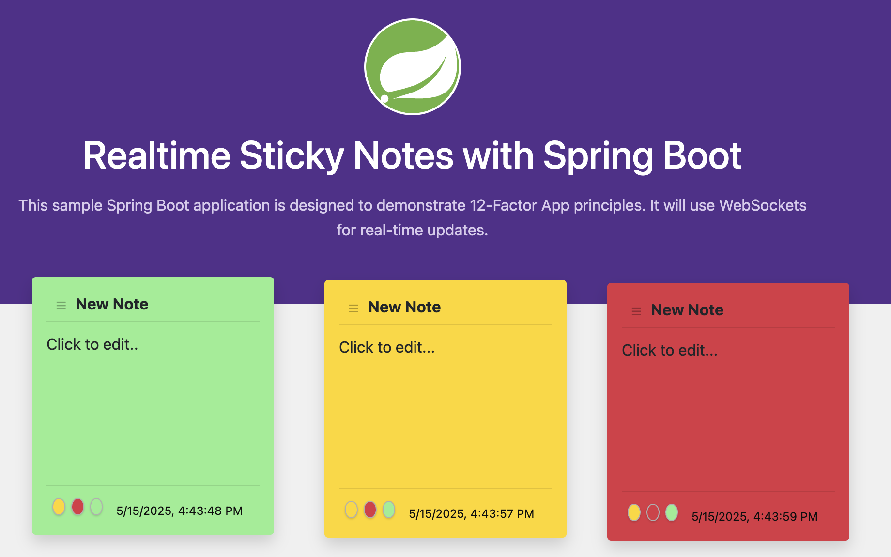

# 12-Factor Spring Boot Notepad Application

This is a Spring Boot application demonstrating the Twelve-Factor App methodology.

To view the presentation click [here](https://heroku-examples.github.io/java-spring-12factor/presentation.html). 

If you downlaod the repo open `presentation.html`.

In either case you can also review slide notes for more information.



## Prerequisites

*   [Git](https://git-scm.com/downloads)
*   [Heroku CLI](https://devcenter.heroku.com/articles/heroku-cli)
*   OpenJDK (Version specified in `system.properties`, typically 17 or higher)

## Building the Deck

To rebuild `presentation.html` after changing `presentation.md`, first install `marp` then run it.

```bash
marp presentation.md
```

## Local Development

1.  Clone the repository:
    ```bash
    git clone <repository-url>
    cd <repository-directory>
    ```

2.  Run the application locally using Maven:
    ```bash
    ./mvnw spring-boot:run
    ```
    The application will be accessible at `http://localhost:8080`.

## Deployment to Heroku

This application is configured for Heroku deployment using a `Procfile` and `system.properties`.

1.  **Log in to Heroku:**
    ```bash
    heroku login
    ```

2.  **Create a Heroku Application**
    You can create a new app directly or specify a name.
    ```bash
    heroku create
    ```
    If you omit `<your-app-name>`, Heroku will generate one for you. This command also sets up a `heroku` git remote.

3.  **Provision a External Services**

    ```bash
    heroku addons:create heroku-postgresql:essential-0 --wait
    heroku addons:create heroku-redis:mini --wait
    ```

4.  **Deploy the Application:**
    Push your code to the `heroku` remote (ensure your main branch is up-to-date, e.g., `main` or `master` depending on your setup).
    ```bash
    git push heroku main 
    ```
    (If your main branch is named differently, like `master`, use `git push heroku master:main` or `git push heroku master` if your Heroku app's default branch is `master`).

5.  **Check Build Logs & Status:**
    You can view the build process and logs:
    ```bash
    heroku logs --tail
    ```

6.  **Open the Application:**
    Once deployed, open your application in the browser:
    ```bash
    heroku open
    ```

## Configuration

*   **Java Version:** Specified in `system.properties`.
*   **Process Types:** Defined in the `Procfile` (e.g., `web: java -jar target/twelvefactor-notepad-0.0.1-SNAPSHOT.jar`).
*   **Application Properties:** Spring Boot configuration is managed in `src/main/resources/application.properties` and profile-specific properties (e.g., `application-dev.properties`, `application-prod.properties`). Heroku Config Vars can be used to override these properties for different environments. 

## Further Resources & Links

Explore these resources to learn more about the Twelve-Factor App methodology, Spring Boot, and Heroku:

*   **The Twelve-Factor App:** [12factor.net](https://12factor.net/)
*   **Spring Boot Guides:** [spring.io/guides](https://spring.io/guides/)
*   **Spring Cloud Documentation:** [spring.io/projects/spring-cloud](https://spring.io/projects/spring-cloud)
*   **Twelve-Factor Repository:** [github.com/heroku/12factor](https://github.com/heroku/12factor)
*   **[Simplifying JVM App Development with Heroku’s Buildpack Magic](https://www.heroku.com/blog/simplifying-jvm-app-development-herokus-buildpack-magic/)**
*   **Heroku Platform:** [heroku.com](https://www.heroku.com/) (for deploying applications)

If you have questions or suggestions regarding this sample application, please open an issue or pull request!
